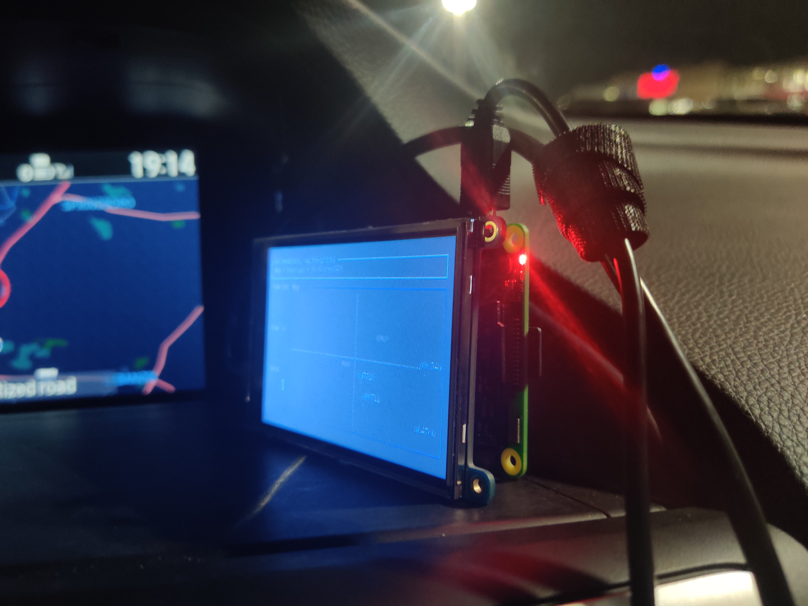
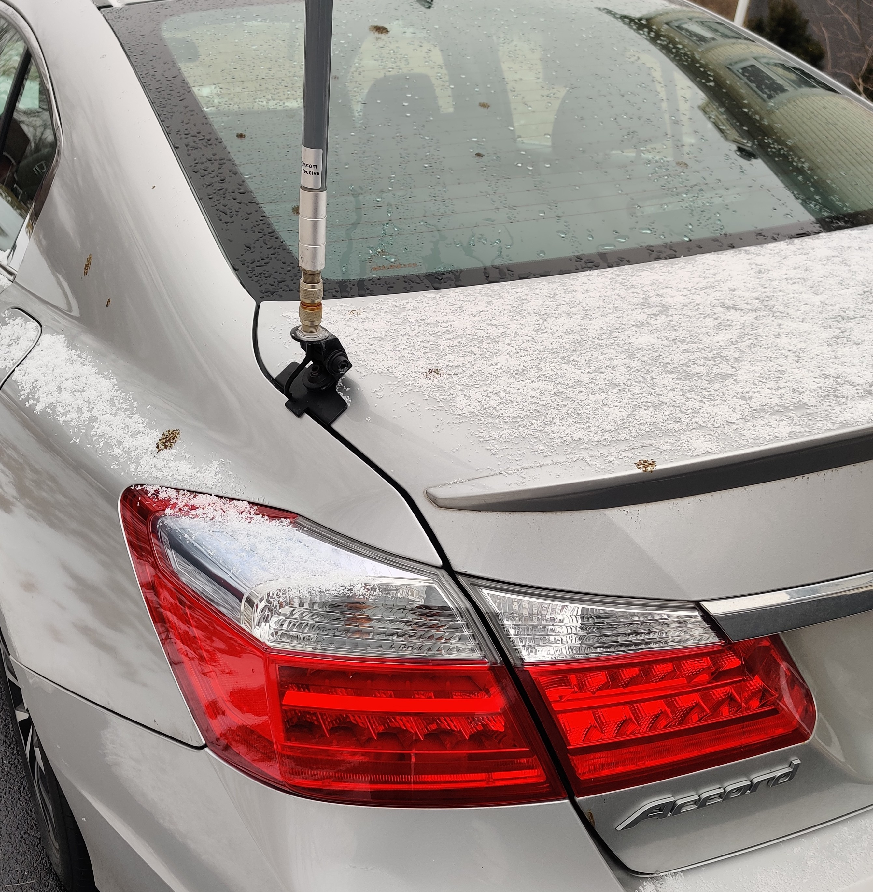
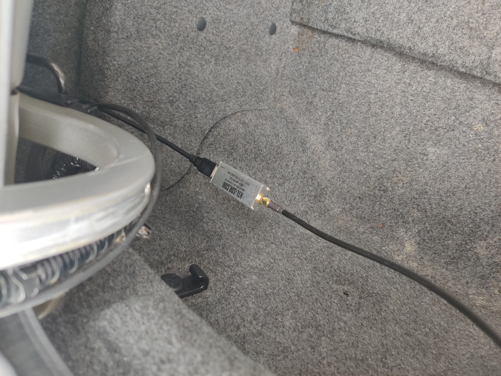
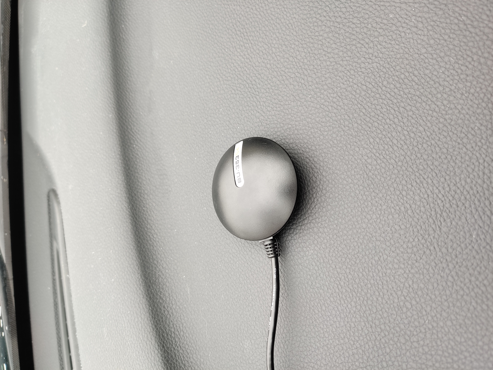

# Raspberry Pi in-car ADS-B Display - with Rust!
_last edited: 03/26/22_

Do you have aircraft flying above your car, or just want to see all the aircraft around your area as you sit in the passenger seat
~~or just really nerdy and want to use the Rust language and a Raspberry Pi in your car~~?
This project will leave you with a Raspberry Pi touchscreen that uses our `radar` and `dump1090_rs` applications to do just that!

This project is entirely open-source, checkout the software on github: 
- [radar](https://github.com/rsadsb/adsb_deku/)

- [dump1090_rs](https://github.com/rsadsb/dump1090_rs/)


## Overview
The following is myself using the touchscreen controls and viewing the positions of about ~60 airplanes over my car.


Here we can see the aircraft info being updated to the table in real-time as we receive more messages.


We can also see all the positions of all airplanes we have captured.





# Requirements
See [quickstart](quickstart.md) for the base hardware requirements and software installation.

## Hardware
### New hardware
- Raspberry Pi (I have a Raspberry Pi 3 Model B Rev 1.2, but any version *should* work)
- N-Type Male to N-Type Male connector
- A car ;)
- RS-840 Original Comet Antenna Lip Mount - No Cable
- SMA Male to N Female Bulkhead
- PiTFT Plus 480x320 3.5"
- GlobalSat BU-353-S4 USB GPS


#### Car Mount
The lip mount car antenna makes you the real nerd.



#### rtlsdr 
The `rtlsdr` software defined radio allows us to capture the airplanes emitted signal.



#### GPS
Using the `radar --gpsd` option and a `gpsd` daemon, we automatically get the lat and lon position.



## Software

### PiTFT Plus
You will need to following the instructions located on the adafruit site for installing the touchscreen drivers:
[link](https://learn.adafruit.com/adafruit-pitft-3-dot-5-touch-screen-for-raspberry-pi)

Add `        Option "TransformationMatrix" "0 -1 1 1 0 0 0 0 1"` to `touchscreen` in `/usr/share/X11/xorg.conf.d/40-libinput.conf` for inverting the touchscreen input 90 degrees.

### SoapySDR
We need soapysdr version 0.8.1, so install from the following commands.

#### SoapySDR
```
> git clone https://github.com/pothosware/SoapySDR.git
> cd SoapySDR
> git checkout soapy-sdr-0.8.1
> mkdir build
> cd build
> cmake ../
> make -j4
> make install
> ldconfig
```

#### SoapyRTLSDR
```
> apt install librtlsdr-dev
> git clone https://github.com/pothosware/SoapyRTLSDR.git
> git checkout git checkout soapy-rtl-sdr-0.3.3
> mkdir build
> cd build
> cmake ../
> make -j4
> make install
> ldconfig
```

### gpsd
To use the `radar` `--gpsd` setting, you will need the GPS daemon installed. This works nicely when you are in a car, since the GPS will take care of always setting your new lat/lon position.
```shell
> apt install gpsd
> systemctl enable --now gpsd
```

Add your USB device to the config, for example adding a serial USB GPS device `/dev/ttyUSB0`.
```shell
> cat /etc/default/gpsd
# Default settings for gpsd.
START_DAEMON="true"
GPSD_OPTIONS=""
DEVICES="/dev/ttyUSB0"
USBAUTO="true"
```

Restart the gpsd service after changing the config.
```
> systemctl restart gpsd
```
### dwm
This is the simplest X server display manager I can find, leaving our applications running nicely with
the small ARM processor on board the raspberry pi. I also used a patch that adds an autostart script.

```shell
> apt install libx11-dev libxft-dev libxinerama-dev xinit
> git clone https://git.suckless.org/dwm
> curl -O https://dwm.suckless.org/patches/autostart/dwm-autostart-20210120-cb3f58a.diff
> git apply dwm-autostart-20210120-cb3f58a.diff
> make
> sudo make install
```

Apply changes to `~/.Xinitrc` file. Depending on your shell, you will need to auto login to your
raspberry pi and run `startx` to start dwm.
```shell
> cat ~/.Xinitrc
exec dwm
```

Add the following to `/etc/profile` for starting dwm at login:
```
if [ -z "${DISPLAY}" ] && [ "${XDG_VTNR}" -eq 1 ]; then
  exec startx
fi
```

If you want to disable the dwm topbar as I have, modify this in the `config.h`:
```
static const int showbar            = 0;
```

### st
Simple Terminal.
```
> apt install st
```

### [dump1090](https://github.com/rsadsb/dump1090_rs)
#### systemd
This will start `dump1090` and attach to an SDR at every bootup.
Note you will need to change `ExecStart` and `WorkingDirectory` to whatever location you installed `dump1090` to.
```
> cat /etc/systemd/system/dump1090.service
[Unit]
Description=Start ADS-B Demodulation Server
After=network.target

[Install]
WantedBy=multi-user.target

[Service]
Type=simple
ExecStart=/home/pi/.cargo/bin/dump1090
WorkingDirectory=/home/pi/.cargo/bin
Restart=always
RestartSec=5
StandardOutput=syslog
StandardErorr=syslog
SyslogIdentifier=%n
```

```
> systemctl enable --now dump1090
```

### [radar](https://github.com/rsadsb/adsb_deku)
#### autostart

Add to dwm autostart file: `~/.autostart`. This will automatically start `radar` in `st`.
The following is an example of the `autostart.sh` file that I use.
If you want more airports, check out the `--aiports` option: [image](https://user-images.githubusercontent.com/15236002/151717559-c1692dc8-4ce7-42c6-bbe7-0bf9a24338ab.png).
```
> cat ~/.dwm/autostart.sh
#!/usr/bin/sh
st -e ~/.cargo/bin/radar --lat="39.0" --long="-84.00" --scale="0.80" \
--gpsd --disable-lat-long \
--touchscreen \
--locations "(wpafb,39.827793,-84.045894)" "(KMGY,39.591672,-84.227865)" \
"(DAY,39.898899,-84.2287941)" "(CVG,39.0537296,-84.6500094)" "(CMH,39.9999399,-82.8893654)" \
"(IND,39.7168593,-86.2977839)" "(KAOH,40.7588499,-83.8936466)" "(FDY,40.6141522,-84.2637368)" \
"(fhq,39.4503696,-82.2616143)" "(mwo,39.4670316,-84.3879972)" "(rma,39.7298745,-84.8377054)" \
"(fma,38.2256493,-84.0172027)" "(fwa,41.0588807,-85.2668302)"
```


# Discuss
* [rtl-sdr.com article](https://www.rtl-sdr.com/rsadsb-terminal-based-aircraft-radar-on-the-raspberry-pi/)
* [rtl-sdr.com twitter](https://twitter.com/rtlsdrblog/status/1493415462780104706)
* [reddit/rust](https://www.reddit.com/r/rust/comments/sr4ara/raspberry_pi_incar_adsb_display_with_rust/)
* [hackernews](https://news.ycombinator.com/item?id=30317976)
* [myriadRF(limesdr) OTA twitter](https://twitter.com/MyriadRF/status/1497257351128231950)
* [myriadRF(limsdr) OTA article](https://myriadrf.org/news/ota-ads-b-tracking-at-the-terminal-open-ran-silicon-beginners-guides-and-more/)
