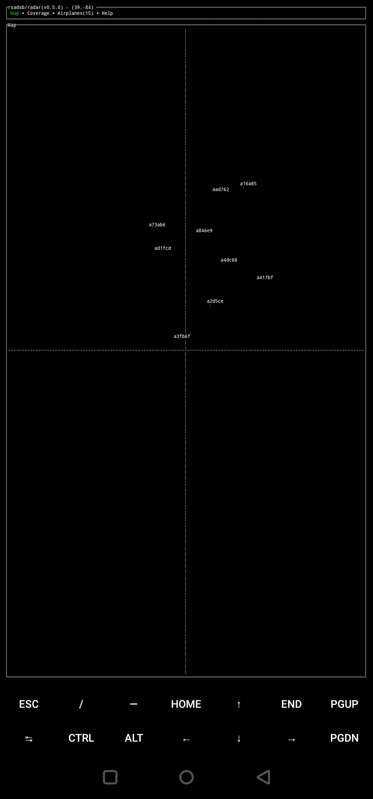
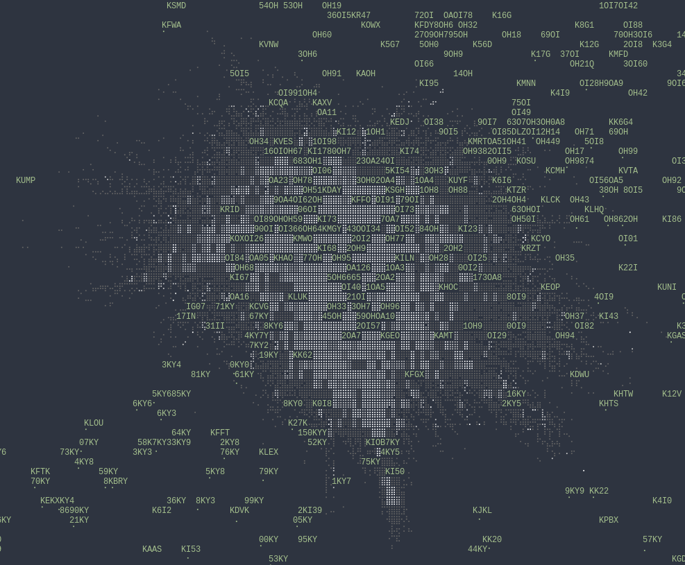

# v0.5.0 Release Notes - Feb 12, 2022

  

[rsadsb](https://github.com/rsadsb) is happy to announce v0.5.0 of our library and tools.
We're proud to have over 100 stars on the main repo, thanks for the support!
A huge [thanks](thanks.md) to all.

See [quickstart guide](quickstart.md) for a installation guide.

See [Raspberry Pi in-car ADS-B Display - with Rust!](rasp-pi-display.md) for my blog post on using my libraries and applications for an in-car ADS-B display.

If you want to track Elon Musk with Rust, check [this repo](https://github.com/rsadsb/elons-jets-rs) out ;)

## Links / Changelogs

All code is released under the [github/rsadsb](https://github.com/rsadsb) account.
Release binaries are available at the following links.

### [adsb_deku v0.5.0](https://github.com/rsadsb/adsb_deku/releases/tag/v0.5.0)

See [CHANGELOG.md](https://github.com/rsadsb/adsb_deku/blob/v0.5.0/CHANGELOG.md) for detailed notes on `adsb_deku` library, `radar`, and `1090`. 

The library docs.rs documentation for this release is [here](https://docs.rs/adsb_deku/0.5.0/adsb_deku/)

### [dump1090_rs v0.5.0](https://github.com/rsadsb/dump1090_rs/releases/tag/v0.5.0)

See [CHANGELOG.md](https://github.com/rsadsb/dump1090_rs/blob/v0.5.0/CHANGELOG.md) for detailed notes on the `dump1090_rs` application. 

## Discuss
- [/r/rust](https://www.reddit.com/r/rust/comments/sr4ara/raspberry_pi_incar_adsb_display_with_rust/)
- [twitter](https://twitter.com/wcampbell42/status/1492607956294250505)

## News
* **rtl-sdr.com 2/15/2020:** [rsadsb: Terminal Based Aircraft Radar on the Raspberry Pi](https://www.rtl-sdr.com/rsadsb-terminal-based-aircraft-radar-on-the-raspberry-pi)
    - [twitter](https://twitter.com/rtlsdrblog/status/1493415462780104706)
- **myraidRF OTA 2/25/2020:** [OTA: ADS-B Tracking at the Terminal, Open RAN Silicon, Beginner’s Guides, and More](https://myriadrf.org/news/ota-ads-b-tracking-at-the-terminal-open-ran-silicon-beginners-guides-and-more/)
    - [twitter](https://twitter.com/MyriadRF/status/1497257351128231950)

## radar
`x86_64-unknown-linux-gnu`

`armv7-unknown-linux-gnueabihf`

`aarch64-linux-android`

### Updates

- Now uses Mercator projection for display the airplanes on the map.

- Add Mouse and touchscreen controls! This allows moving the map center location, as well as choosing the display mode.
See the `--touchscreen` option for displaying zoom controls for platforms such as the raspberry pi.

- Airport data can be downloaded from [mborsetti/airportsdata](https://github.com/mborsetti/airportsdata)
and imported using the `--airports` and `--airports-tz-filter` option.
The following shows all airports big and small near my data collection site.

The following is an example of zooming out and seeing all New_York and Chicago time zone airports.
This looks pretty cool even if it's very not useful :)

And Coverage!

- `--cities` are now named `--locations`

- Range and Distance checks are now added, fixing some long standing bugs with mis-decoding lat/lon positions.
([!101](https://github.com/rsadsb/adsb_deku/pull/101))

- Added `Help` tab with a table of key bindings: ([!107](https://github.com/rsadsb/adsb_deku/pull/107))

- Thanks [@Jachdich](https://github.com/Jachdich) for fixing a bug in `radar` with time: ([!57](https://github.com/rsadsb/adsb_deku/pull/57))

## adsb_deku (library)

- Thanks [@amacd31](https://github.com/amacd31) for fixing a bug in CPR calculations.
([!78](https://github.com/rsadsb/adsb_deku/pull/78)).
- Thanks [@mikemorris](https://github.com/mikemorris) for fixing a link in my README.md.
([!61](https://github.com/rsadsb/adsb_deku/pull/61)).

## dump1090

- Now uses the [soapysdr](https://github.com/pothosware/SoapySDR) library for multi-sdr platforms
support through the [soapysdr-rs](https://github.com/kevinmehall/rust-soapysdr) crate.
Currently tested are the rtl-sdr and the hackrf support.
If you test this on new SDR platforms, merge requests welcome for default gain settings!
